## GitHub

In dit hoofdstuk komen zowel GitHub als GiHub desktop client aan de orde. Geonovum heeft op github een eigen ‘onderkomen’: <a href='https://github.com/geonovum' target='_blank'>https://github.com/geonovum</a>. In dit hoofdstuk staat beschreven wat je moet doen om “up-and-running” te komen voor het uitvoeren van je beheertaken op GitHub. Hoe je een account aanmaakt, en hoe je de benodigde software installeert.

### Installatie en inrichting

#### 36347409525000Aanmaken GitHub account

Als je nog geen GitHub account hebt, of als je een apart GitHub account wil maken voor je Geonovum werkzaamheden, ga in je internet browser naar: <a href='https://github.com/join' target='_blank'>https://github.com/join</a>  

Dan zie je het scherm dat hiernaast staat. Maak in dat scherm een usernaam aan waarmee je op GitHub gaat werken. 

<u>Tip</u>: als je met meerdere accounts gaat werken, zorg er dan voor dat aan de accountnaam kan zien waarvoor die dan gebruikt moet worden. (Bijvoorbeeld door die naam te eindigen op –GNM). Verplicht is dit uiteraard niet. 

Vul in het veld username je nieuwe GitHub naam in.

Vul in het veld email adress je geonovum mailadres in

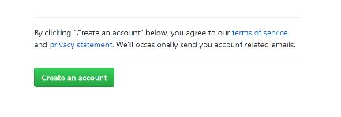</img>
Klik vervolgens op “Create Account” en dan wordt je account aangemaakt. 

Kies in dit scherm je persoonlijke plan. Bij Geonovum gebruiken we de gratis versie, dus selecteer die.

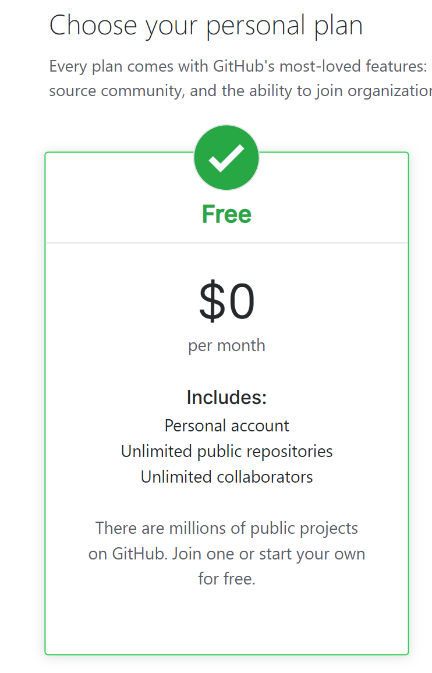</img>
#### 33451807620000Installeren GitHub desktop

Ga in je internet browser naar <a href='https://desktop.github.com/' target='_blank'>https://desktop.github.com/</a> 

Klik daar op download for Windows (64bit).

Nu wordt de installer gedownload, en dat zie je linksonder in je browser zoals in het plaatje rechts:

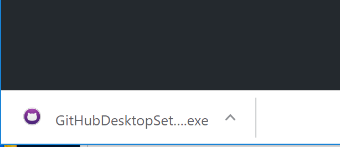</img>
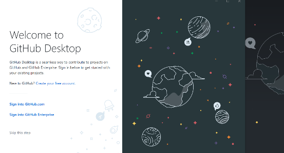</img>
Na starten van de installer verschijnt het scherm hiernaast

Het volgende scherm zal nu openen

Het aanmaken van een account hoeven we niet meer te doen, want dat hebben we in de vorige stap al gedaan. Dus klik op Sign Into Github.com

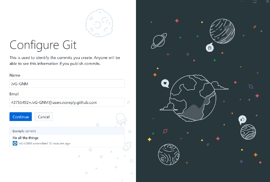</img>
Na Klikken op Sign into Github.com, verschijnt dit scherm. Hier hoeft verder niks ingevuld te worden, dus klik op continue.

In dit scherm kan je desgewenst het vinkje bij het versturen van anonieme data uitzetten. Daarna klikken op Finish.

GitHub Desktop is nu geïnstalleerd.

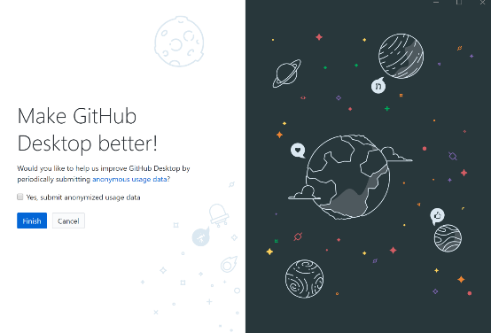</img>
#### Opties voor GitHub desktop

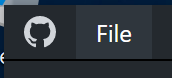</img>
GitHub Desktop kan worden aangepast aan persoonlijke voorkeuren. Dat doe je door in het hoofdscherm van de GitHub Desktop op het menu “File” te klikken en vervolgens voor “Opties” te kiezen.

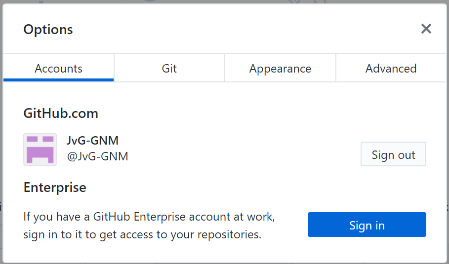</img>
In het Accounts scherm staat hoe je bent ingelogd bij GitHub. Hier kan je uitloggen en opnieuw inloggen als je meerdere GitHub Accounts hebt.

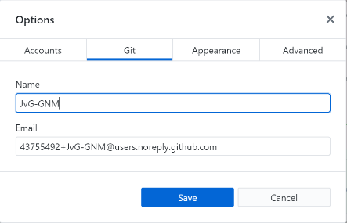</img>
In het tabblad “Git” kan je je Github Naam eventueel aanpassen. De GitHub Email is de email die intern binnen Github wordt gebruikt. Die hoeft niet gewijzigd te worden.

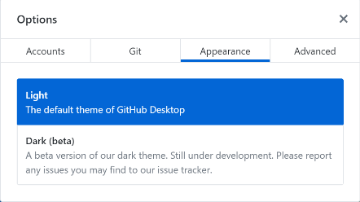</img>
In het tabblad “Appearance” kan je ervoor kiezen om in Light of Dark modus te werken. Hiermee verander je alleen de achtergrondkleur van de GitHub Desktop omgeving.

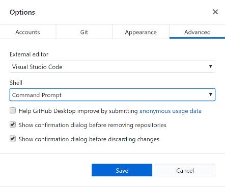</img>
In dit scherm kan je de voorkeurs editor instellen. Default wordt gekeken naar de reeds aanwezige tekst editors. Omdat GitHub van nature een samenwerkomgeving is voor het ontwikkelen van programmatuur, gaat het hier om “platte tekst” editors.

### Werkwijze Geonovum 

#### 208534025590500De Geonovum GitHub pagina 

Geonovum heeft een eigen GitHub Bedrijfspagina: <a href='https://github.com/Geonovum' target='_blank'>https://github.com/Geonovum</a>. 

 

Voor alle projecten die een product maken of beheren wordt een repository aangemaakt.

Het aanmaken van een repository staat beschreven in paragraaf <a href='#_Ref17107242'>2.3.1.  

#### Mappenstructuur in de respository 

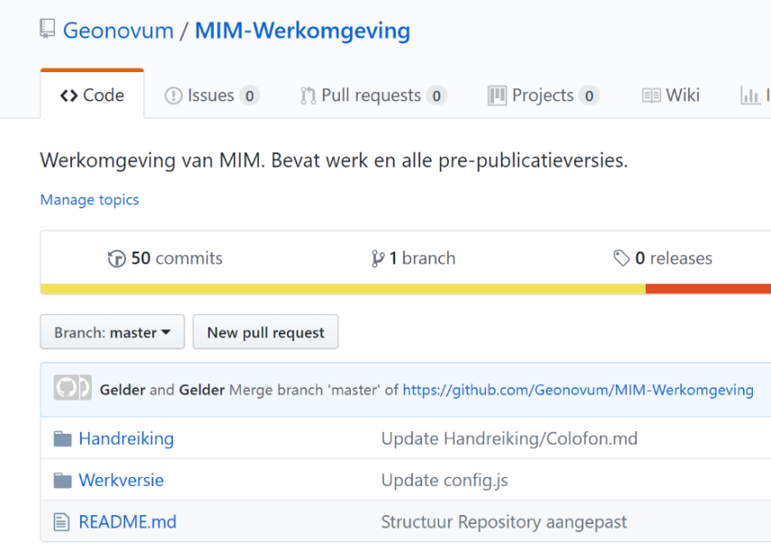</img>
In de Repository maak je indien nodig submappen aan. Submappen zijn handig als er in je Repository meer dan één ReSpec document komt te staan. Over ReSpec meer in hoofdstuk 3.

Hiernaast een afbeelding van de GitHub Repository voor MIM. Twee mappen omdat MIM twee documenten bevat.

Ook maakt GitHub standaard een readme.md aan. De readme staat in het “Markdown” formaat, waarover in de volgende paragraaf meer.

#### Readme.md 

In de readme.md file staat nog eens beschreven Wat de inhoud van de Repository is. Neem ook de link naar de webversie van de documenten hier op, dan is het voor bezoekers gemakkelijker om het document te openen in een browser.

Neem altijd een link naar <a href='https://docs.geostandaarden.nl/' target='_blank'>https://docs.geostandaarden.nl/</a> op, en in het geval het technische documenten betreft zoals UML’s, XSD’s, GML’s, XML’s een link naar <a href='http://register.geostandaarden.nl/' target='_blank'>http://register.geostandaarden.nl/</a> in het Readme bestand op. 

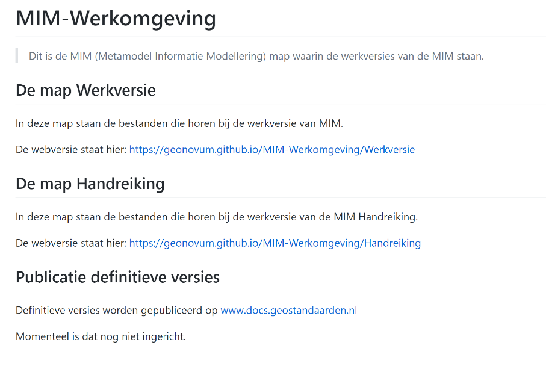</img>
### Aan de slag met GitHub 

In deze paragraaf een beschrijving van hoe je in GitHub een nieuwe repository aanmaakt, en hoe je die synchroniseert met je lokale GitHub client.

#### 361188023622000Het maken van een nieuwe repository

Een nieuwe repository maak je aan in de Centrale GitHub omgeving. 

Klik in de banner bovenaan de pagina, naast je profielfoto op “+” en kies “Create Repository” 

Nadat je op “+” hebt geklikt, verschijnt het scherm hieronder.

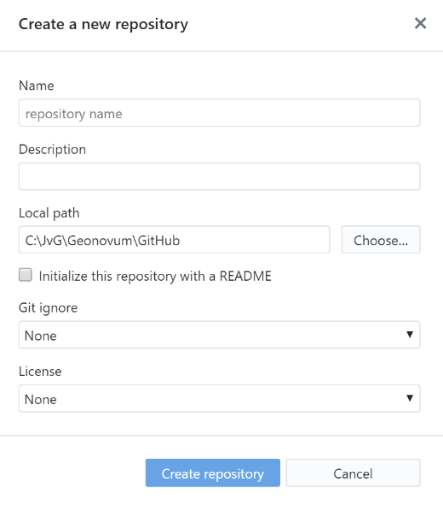</img>
Vul hier de naam van de repository in. Deze naam moet uniek zijn binnen de Geonovum omgeving, en voor MIM is dat geworden: MIM-Werkomgeving

Denk goed na over de naam, en houd het kort en bondig, immers deze naam wordt onderdeel van de URL van de Repository

Vul ook de beschrijving in van het project.

Belangrijk is dat je lokaal dus op je werkplek de mappen ook logisch inricht. Maak dus eerst lokaal een map aan waarin je je lokale Repository neerzet. Het is slim om alle lokale Repositories onder een mapje “GitHub” neer te zetten.

Geef als local path de naam van de GitHub map op. GitHub zal dan de naam van de standaard als mapnaam aanmaken onder de lokale GitHub map.

Het is wel zo netjes om een readme file aan te maken, hierin zet je een korte omschrijving van de repository. Vinkje aanzetten dus. Klik vervolgens op “Create Repository”

#### GitHub Clone: eerste keer ophalen van de centrale repository 

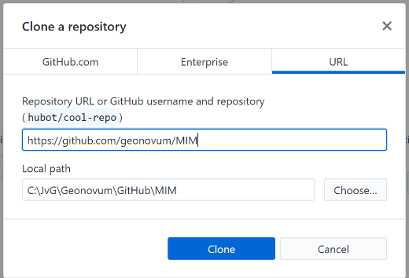</img>
Start de GitHub Client, en kies in het menu File voor Clone Repository. En kies de Repository die je wil clonen (in dit geval Geonovum/MIM). Als Local Path kies je een logische plek op je PC/Laptop. (Tip: het is handig om één plek voor je Github Repositories te maken, bijvoorbeeld C:. Na het aanklikken van de knop clone wordt een lokale kopie gemaakt. Github weet welke versie je hebt opgehaald, en zal de wijzingen die je maakt netjes voor je bijhouden.

In de map die je als local path hebt opgegeven komt de mappen structuur te staan zoals hierboven beschreven. 

#### GitHub Pull origin: ophalen van wijzigingen

Een pull commando werkt de lokale versie van je GitHub Repository bij. Wijzigingen die zijn gedaan in de centrale repository (dus op Github.com) worden ook doorgevoerd in je lokale kopie. Het uitvoeren van een pull doe je door in het menu Repository op pull te klikken.

NB: Voer dit commando regelmatig uit als er meerdere mensen in de repository werken, om conflicterende wijzigingen te voorkomen.

#### GitHub Commit to Master: wijzigingen opslaan 

Met de knop Commit to master zet je de wijzigingen die je hebt gedaan klaar om te uploaden naar de Centrale GitHub Repository. GitHub maakt daartoe een versie aan,

die je verplicht voorziet van een summary en optioneel van een Description Let op: met

het committen heb je dus nog niks ge-upload.

#### GitHub Push origin of Pull request: wijzigingen uploaden 

Nadat je de wijzigingen hebt gecommit, moeten ze richting de centrale repository. Nu zijn er twee mogelijkheden. Ofwel je hebt schrijfrechten op de Centrale Repository, of je hebt ze niet. In het eerste geval kan je een Push Origin uitvoeren, dan worden de wijzigingen meteen in de Centrale GitHub Repository verwerkt. In het tweede geval doe je een Pull request bij de eigenaar van de Repository om de wijzigingen door te voeren. Github maakt dan een eigen versie voor je aan (dat heet een fork) en vraagt aan de eigenaar van de Repository om die fork te verwerken in de Centrale Repository.

