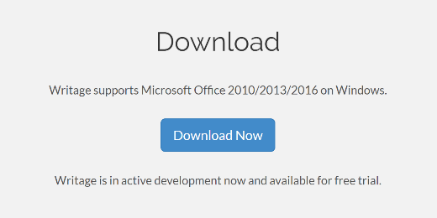

## Markdown

Voor het extern publiceren van documenten en standaarden gebruiken we “ReSpec”. ReSpec werkt met HTML en Javascript. Dat is niet voor iedereen de meest voor de hand liggende documentatie tooling. Gelukkig ondersteunt ReSpec ook het gebruik van Markdown

### Wat is Markdown

Markdown is een lichtgewicht opmaaktaal op basis van platte tekst die zodanig ontworpen is dat het gemakkelijk valt te converteren naar HTML en andere formaten middels een applicatie met dezelfde naam. Markdown wordt vaak gebruikt voor de opmaak van project documentatie (README-bestanden), eenvoudige CMS-systemen en berichten in online fora. Tekst in deze opmaaktaal is gemakkelijk te maken met een simpele teksteditor.

Het ontwerpdoel van de taal is leesbaarheid. Teksten geschreven met behulp van Markdown worden geacht al leesbaar te zijn voordat opmaak is toegepast op de tekst. Opmaakinstructies en tags zijn dan ook niet te vinden in pure Markdown[1] bron: https://nl.wikipedia.org/wiki/Markdown  . 

### Markdown plugin voor Microsoft Word

Zoals gezegd: Markdown is een zgn. plat tekstformaat dat je direct met een “platte teksteditor” zoals “kladblok” kan intikken, maar er is ook een mooiere manier. Je kan in MS-Word een plugin installeren, zodat je gewoon in Word kan editen, en het bestand opslaat als Markdown bestand. (Herkenbaar aan de .md extensie).

</img>
#### Installeren van de plugin 

Ga naar <a href='http://www.writage.com/' target='_blank'>http://www.writage.com/</a>. Klik op Download now, en voer het installatie programma uit. 

#### Werken met Markdown in Word    

Door de installatie van writage is een stijlen bibliotheek ontstaan, waarmee je gewoon zoals je altijd al gewend was in Word kan werken. Kopteksten, tabellen enz. worden door de plugin bij het opslaan als Markdown document. Vergeet niet om het document op te slaan als met de extensie .md. Het heeft echter sterk de voorkeur de md bestanden in een andere tekst editor te bewerken omdat die er voor zorgen dat problemen in de code zichtbaar worden. Daarnaast wordt echt in md opgeslagen, zonder vervuiling van van Microsoft. 

#### Werken met Markdown in Visual Code

Een andere optie om de Markdown bestanden te editen is het gebruiken van Visual Studio Code. Dit is een editor die eigenlijk voor het schrijven van software is, maar ook heel goed te gebruiken als teksteditor. Het voordeel is dat je alle bestanden die bij je ReSpec omgeving horen, in één editor ziet staan, en kan aanpassen. Het biedt je meer overzicht dan werken in Word.

Een voordeel van het werken met Micosoft Visual Studio is dat het mooi integreert met de GitHub Desktop Client, zo kan je meteen de editor opstarten vanuit de client, en kan je conflicten bij het committen van versies mooi oplossen. Als je alleen maar content wil editen, biedt Microsoft Word met de Markdown plugin voldoende functionaliteit.

Vooral het maken van Markdown tabellen in een tekst editor kan vervelend zijn. in Een handige online tool om tabellen naar Markdown te converteren is <a href='https://www.tablesgenerator.com/markdown_tables' target='_blank'>https://www.tablesgenerator.com/markdown_tables</a>. 

#### Werken met Markdown in Notepad++

Deze teksteditor is gratis te downloaden en heeft meer functionaliteit dan notepad/ kladblok/ wordpad. Deze is vergelijkbaar met textpad maar geeft visueel (in kleuren) ondersteuning in de code en bij fouten daarin. 

